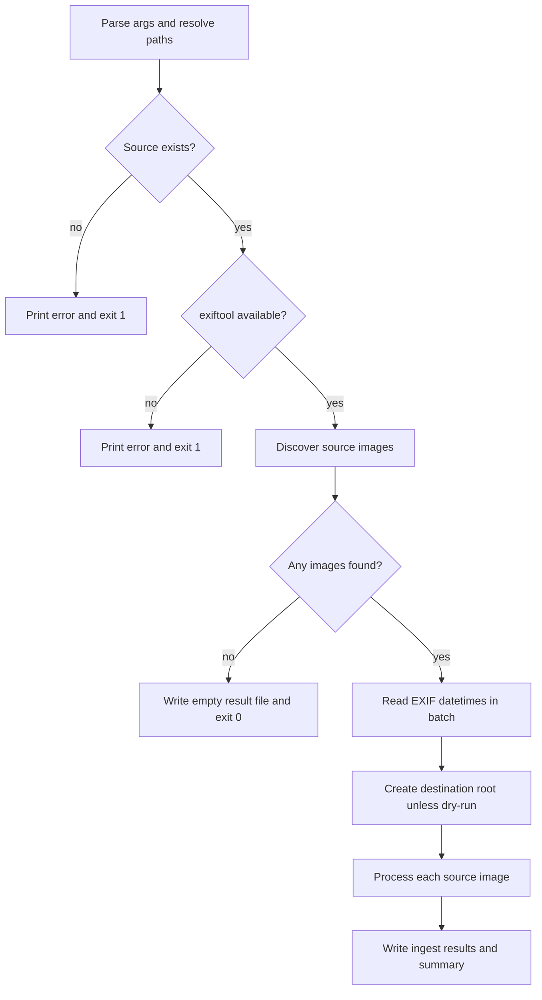

# ingest_photos.py flow

This document provides execution notes for `tooling/ingest_photos.py` and how
the generated files become gallery pages.

## Local photo workflow

Add new photos under `inbox/<category>/` and run:

```bash
make ingest
```

`make ingest` uses `INGEST_SRC=inbox` unless another source is passed
explicitly.

The ingest step:

- reads uploaded images from category subfolders under the source directory
- writes published files into `content/images/photos/<category>/`
- removes source files only after ingest succeeds so the same photos are not
  imported twice
- stages generated files before committing them so a failure does not leave a
  partial import behind
- requires `exiftool`
- skips photos that do not provide `EXIF:DateTimeOriginal`

Each ingested photo creates:

- `content/images/photos/<category>/<id>-display.webp`
- `content/images/photos/<category>/<id>-thumb.webp`
- `content/images/photos/<category>/<id>.json`

Any new category folder under the source inbox becomes available as a gallery
page at `/<category>/` after ingest and build.

## How photo pages work

The photo pipeline has two main steps:

1. `tooling/ingest_photos.py` reads uploaded images from `inbox/<category>/`
   and writes web-ready files into `content/images/photos/<category>/`.
2. `plugins/photos/photos.py` reads those generated files and passes photo data
   to the templates that render gallery pages. The plugin reads the photo
   location from Pelican settings via `PHOTOS_PATH`.

Useful commands:

```bash
# Use the default local inbox.
uv run python -m tooling.ingest_photos --src inbox

# Preview planned outputs without writing files.
uv run python -m tooling.ingest_photos --src inbox --dry-run
```

## High-level flow



## Detailed step explanations

### Dropbox staging context

Dropbox uploads are read from `site-photo-inbox/...`.

During sync, files are downloaded to a temporary local folder. In this run,
`src_dir` points to that local folder, not to Dropbox.

The flow is:

1. Download phase writes one state file entry per Dropbox file with
   `source_path` and `source_file`.
2. Ingest phase reads each `source_file` and adds `status: ingested` or
   `status: skipped` to that same state file entry.
3. Apply phase reads the final state file and applies the matching Dropbox
   action.

For state file structure and examples, see `docs/DROPBOX_SYNC_STATE.md`.

### Step 1: figure out the main folders

- `project_root` is the root of this repository.
- `src_dir` is the inbox folder that contains the uploaded photos.
- `dest_dir` is where the generated website photo files will be written.

Input paths are converted to absolute paths up front so the rest of the script
does not have to guess where files live.

### Step 2: make sure the source inbox exists

If the user points to a folder that is missing, there is no point in
continuing. The script stops immediately and prints a clear message instead of
failing later with a more confusing error.

### Step 3: make sure exiftool is installed

This project uses the capture date stored in photo metadata. That date becomes
part of the generated JSON metadata and also helps build the final photo id.
The ingest process depends on `exiftool` to read this metadata.

### Step 4: collect candidate photos

`source_images()` walks through the inbox and keeps only file types the
pipeline can process, such as JPG, PNG, and WebP.

An empty inbox is not an error. It means there is nothing new to do, so the
script exits cleanly.

### Step 4a: read EXIF capture dates in one batch

Photos are still processed one by one later, but asking `exiftool` per file
would repeat process startup overhead. The script requests EXIF metadata for all
candidate files in one batch and reuses the parsed results.

### Step 5: prepare counters

- `ingested` counts photos that were successfully processed.
- `skipped` counts photos deliberately ignored, for example because of missing
  metadata or unresolved category.

### Step 6: ensure destination root exists

This runs only in normal mode. In `--dry-run` mode, the goal is to preview what
would happen without changing the filesystem.

Category folders such as `content/images/photos/iphone/` are still created only
when ingest actually writes a photo into them.

### Step 7: process each source image

The script processes photos one by one so each file gets its own category
lookup, metadata lookup, generated filenames, and final status.

#### Step 7a: read category from path

Normally category comes from the inbox folder name, for example
`inbox/street/picture.jpg` becomes category `street`.

Category comes from the first subfolder under the source root. If a file is
directly under the source root, it is skipped because the site would not know
which gallery page should display it.

#### Step 7b: validate capture date

Every imported photo is expected to have a real capture timestamp. The timestamp
is used for the `DateTimeOriginal` JSON field and feeds into the generated photo
id.

If a photo lacks a supported EXIF capture date, the script skips it instead of
inventing one so stored metadata remains trustworthy.

#### Step 7c: plan outputs and metadata

At this point the script knows:

- target category folder
- unique photo id
- final display image path
- final thumbnail image path
- metadata JSON path

It also builds the metadata dictionary that is written to disk and read later by
the site build.

#### Step 7d: dry-run behavior

In dry-run mode, the script does not write, move, or delete anything. It only
prints which files would be created.

This is useful for sanity-checking a batch before allowing filesystem changes.

#### Step 7e: run real import

This is where files are actually created.

The script calls `ingest_photo_atomically()` so related outputs for one photo
stay in sync. That helper stages generated files first and commits them only
when the full set is ready. Source removal happens only after ingest succeeds.

#### Step 7f: record success

The script records and prints per-photo success. This gives immediate feedback
during larger imports and helps identify the most recently processed file if a
later file fails.

### Step 8: final summary

The final message reports total ingested and skipped photos.
