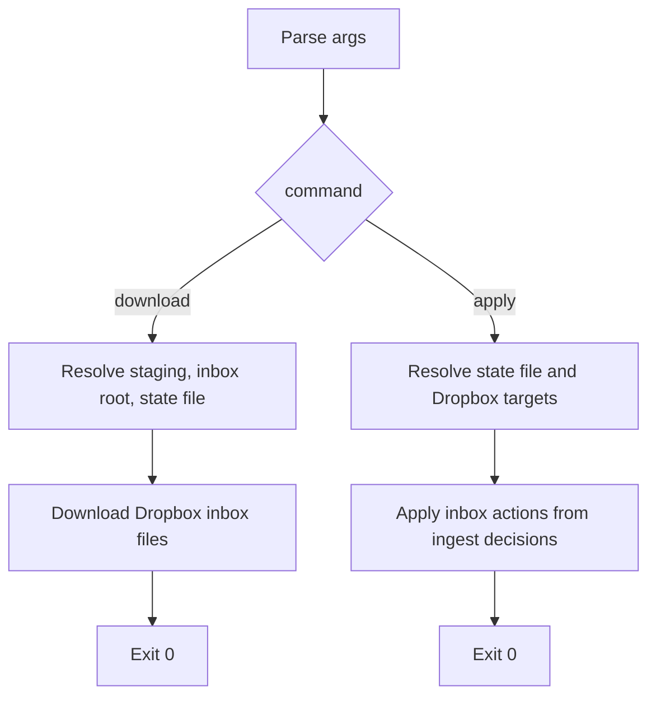

# sync_dropbox_inbox.py flow

This document provides detailed execution notes for
`tooling/sync_dropbox_inbox.py`.

## High-level flow

## Detailed step explanations

For state file structure and examples, see `docs/DROPBOX_SYNC_STATE.md`.

### Step 1: choose workflow phase

This script has two separate jobs:

- `download`: fetch files from the Dropbox inbox into a local staging folder
- `apply`: remove accepted files from the inbox and quarantine rejected files

The staging folder sits in the middle of those jobs. Dropbox files are
downloaded first, then `tooling.ingest_photos` reads staged files, and only
after that does this workflow modify Dropbox.

Keeping phases separate makes the workflow safer because Dropbox inbox changes
happen only after ingest has decided whether each staged file was accepted or
rejected.

### Step 2: resolve download inputs

- `staging_dir` is the temporary local folder that will receive files.
- `inbox_root` is the Dropbox folder scanned for new uploads.
- `state_file` is the JSON bridge between Dropbox and local ingest: it records
  the original Dropbox path, the local source file, and the current status.

### Step 3: run download phase

The download phase stages files locally and writes the shared sync state file.
It does not decide remove-from-inbox versus quarantine yet because ingest has
not classified files at this point.

### Step 4: resolve apply inputs

By this stage, ingest has already read staged files and updated the shared
state file. That file now tells the workflow:

- which Dropbox inbox file became which local source file
- which files were ingested vs skipped

That allows accepted files to leave the inbox while rejected files go to
quarantine.

### Step 5: run apply phase

Apply reads the shared state file. If any entry is still missing `status`, it
stops instead of guessing. Otherwise it applies the ingest decision back to the
original Dropbox file.

### Fallback return

There is a defensive fallback return at the end of `main()`. In normal use it
should not be reached because argparse requires one of the known commands.
