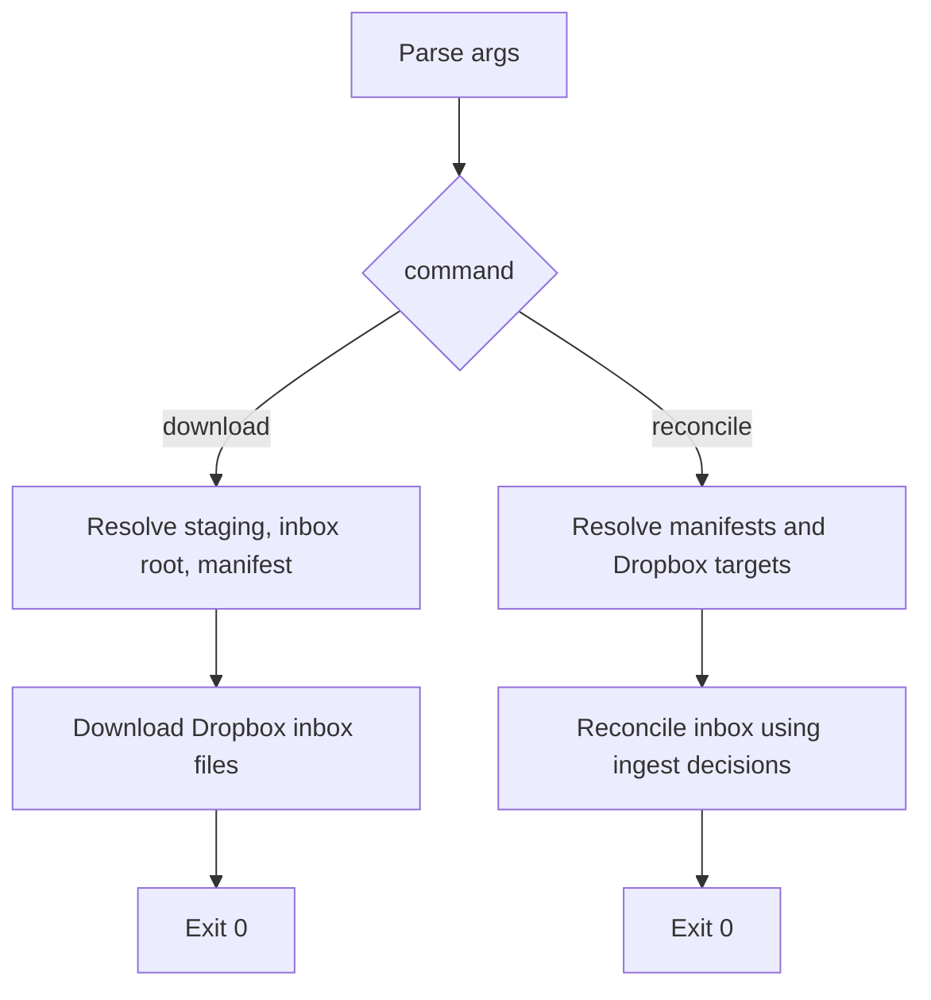

# sync_dropbox_inbox.py flow

This document provides detailed execution notes for
`tooling/sync_dropbox_inbox.py`.

## High-level flow

## Detailed step explanations

For manifest structure and examples, see `docs/MANIFESTS.md`.

### Step 1: choose workflow phase

This script has two separate jobs:

- `download`: fetch files from the Dropbox inbox into a local staging folder
- `reconcile`: remove accepted files from the inbox and quarantine rejected files

The staging folder sits in the middle of those jobs. Dropbox files are
downloaded first, then `tooling.ingest_photos` reads staged files, and only
after that does this workflow modify Dropbox.

Keeping phases separate makes the workflow safer because Dropbox inbox changes
happen only after ingest has decided whether each staged file was accepted or
rejected.

### Step 2: resolve download inputs

- `staging_dir` is the temporary local folder that will receive files.
- `inbox_root` is the Dropbox folder scanned for new uploads.
- `manifest_file` is the JSON bridge between Dropbox and local ingest: it
  records which Dropbox source file produced which local staged file.

### Step 3: run download phase

The download phase stages files locally and writes the download manifest. It
does not decide remove-from-inbox versus quarantine yet because ingest has not
classified staged files at this point.

### Step 4: resolve reconcile inputs

By this stage, ingest has already read staged files and written an ingest
results manifest. Together, the two manifest files tell the workflow:

- which Dropbox inbox file became which staged file
- which staged files were ingested vs skipped

That allows accepted files to leave the inbox while rejected files go to
quarantine.

### Step 5: run reconcile phase

Reconcile reads:

- the download manifest, mapping Dropbox inbox files to local staged files
- the ingest results manifest, describing whether each staged file was ingested
  or skipped

With both manifests together, the workflow applies the ingest decision back to
the original Dropbox file.

### Fallback return

There is a defensive fallback return at the end of `main()`. In normal use it
should not be reached because argparse requires one of the known commands.
